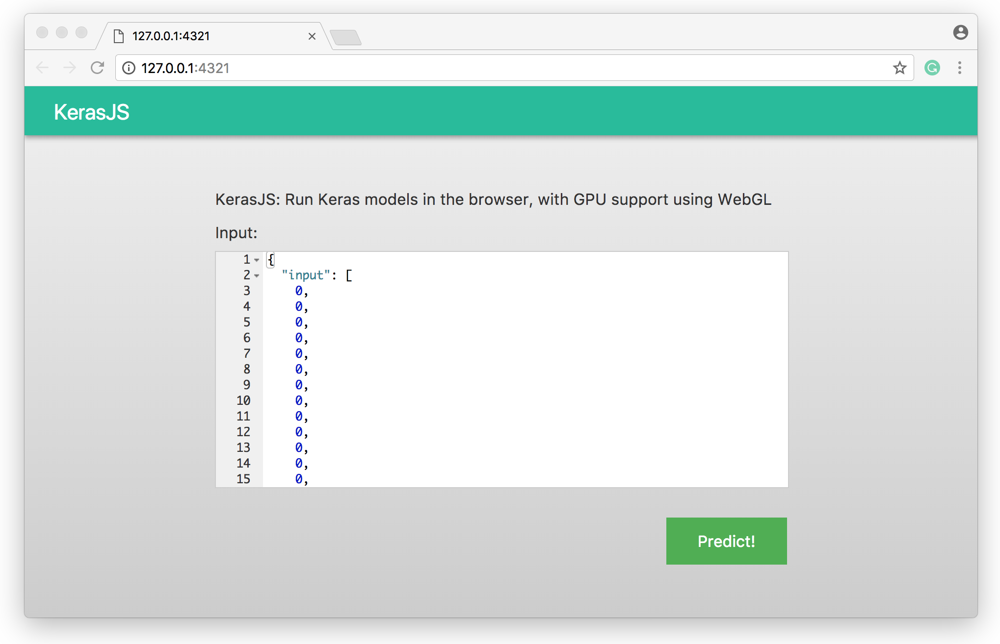

## Run Keras models in the browser using KerasJS

After training a model in Keras, the `kerasjs` package provides tools to 
convert and run Keras models in the browser using KerasJS.

### Installation

```{r eval=FALSE}
devtools::install_github("rstudio/kerasjs")
```

### Conversion

After a model is trained in Keras, export this model to HDF5 format using
`keras::save_model_hdf5()`, then convert to a KerasJS-ready model by running:

```{r eval=FALSE}
library(kerasjs)

# replace with your HDF5 model
model_path <- system.file("models/keras-mnist.hdf5", package = "kerasjs")
  
kerasjs_convert(model_path)
```

### Runtime

After conversion finished, the model is previewed in the browser.



The 'Predict!' button will predict the Keras model in JavaScript, the
HTML/JavaScript can be copied as well:


